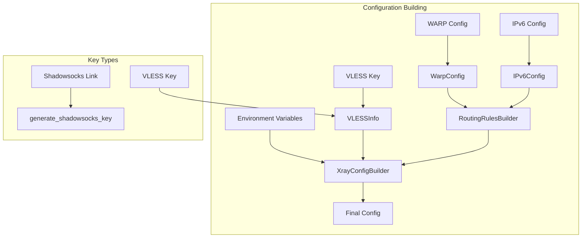
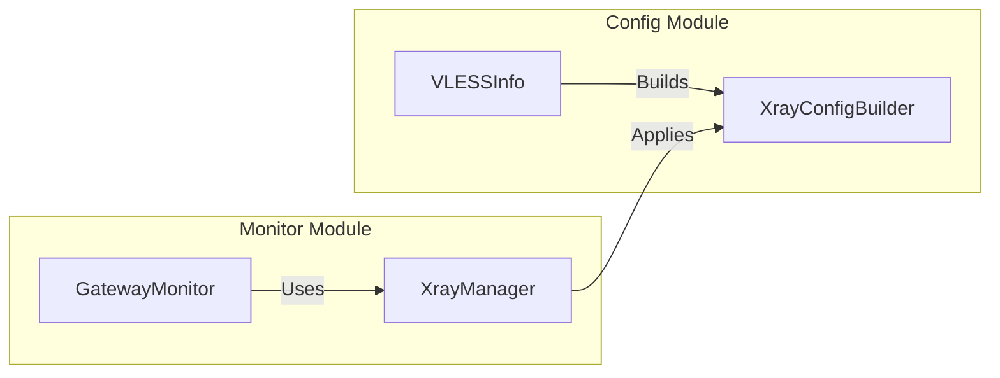

# Config Module - Xray Configuration Builder

## Overview

The `config/` module provides a declarative, modular approach to building Xray proxy configurations. It follows the builder pattern for clean, readable configuration generation and includes specialized components for routing, protocol handling, and network features.

## Module Structure

```
config/
├── __init__.py      # Module exports
├── builder.py       # XrayConfigBuilder class (main builder)
├── vless.py         # VLESS key parsing and configuration
├── warp.py          # Cloudflare WARP proxy configuration
├── ipv6.py          # IPv6 blocking rules
├── rules.py         # Routing rules builder
└── ss.py            # Shadowsocks key generation
```

## Core Components

### 1. XrayConfigBuilder ([`builder.py`](builder.py))

Main class for building Xray configurations using a fluent interface.

#### Key Methods

| Method | Description |
|--------|-------------|
| `set_log_level(level)` | Set Xray log level (debug, info, warning, error, none) |
| `add_inbound(...)` | Add inbound configuration (Shadowsocks, SOCKS, etc.) |
| `add_vless_outbound(...)` | Add VLESS outbound with TLS/REALITY |
| `add_shadowsocks_outbound(...)` | Add Shadowsocks outbound |
| `add_direct_outbound(...)` | Add direct (freedom) outbound |
| `add_blocked_outbound(...)` | Add blocked (blackhole) outbound |
| `add_socks_outbound(...)` | Add SOCKS5 outbound |
| `add_routing_rule(rule)` | Add routing rule |
| `build()` | Build final configuration dict |

#### Example Usage

```python
from config.builder import XrayConfigBuilder, OutboundConfig, StreamSettings

# Create builder
builder = XrayConfigBuilder()

# Add inbound Shadowsocks
builder.add_inbound(
    port=8388,
    protocol="shadowsocks",
    settings={
        "methods": [{"method": "2022-blake3-aes-128-gcm", "password": "your_password"}]
    },
    sniffing={"enabled": True, "destOverride": ["http", "tls"]}
)

# Add VLESS outbound with TLS
builder.add_vless_outbound(
    tag="vless-out",
    address="example.com",
    port=443,
    uuid="your-uuid",
    network="tcp",
    security="tls",
    sni="example.com"
)

# Build config
config = builder.build()
```

### 2. VLESSInfo and parse_vless_key ([`vless.py`](vless.py))

Parse VLESS key strings and convert them to Xray configurations.

#### VLESSInfo Dataclass

| Field | Description |
|-------|-------------|
| `uuid` | UUID from VLESS key |
| `address` | Server address (hostname or IP) |
| `port` | Server port |
| `encryption` | Encryption method (default: "none") |
| `security` | Security type: tls, reality, none |
| `sni` | Server Name Indication for TLS |
| `flow` | Flow setting (e.g., "xtls-rprx-vision") |
| `reality_public_key` | Public key for REALITY |
| `reality_short_id` | Short ID for REALITY |
| `reality_spider_x` | SpiderX for REALITY |

#### Example Usage

```python
from config.vless import VLESSInfo, parse_vless_key

# Parse VLESS key
key = "vless://uuid@host:443?security=tls&sni=example.com#tag"
info = VLESSInfo.from_key(key)
print(info.uuid)  # -> uuid
print(info.address)  # -> host

# Convert to outbound config
outbound = info.to_outbound_config(tag="vless-out")
```

### 3. WarpConfig ([`warp.py`](warp.py))

Cloudflare WARP proxy configuration for routing specific domains through WARP.

#### Key Methods

| Method | Description |
|--------|-------------|
| `is_enabled()` | Check if WARP is enabled with domains |
| `add_domain(domain)` | Add domain to WARP routing |
| `set_domains(domains)` | Set domain list |
| `build_outbound()` | Build WARP SOCKS5 outbound config |
| `build_routing_rules()` | Build WARP routing rules |
| `from_env()` | Create from environment variables |

#### Environment Variables

| Variable | Default | Description |
|----------|---------|-------------|
| `WARP_SOCKS_PORT` | 40000 | WARP SOCKS5 port |
| `WARP_DOMAINS` | "" | Comma-separated domain list |

#### Example Usage

```python
from config.warp import WarpConfig

# Create from environment
warp = WarpConfig.from_env()

# Or manually configure
warp = WarpConfig(
    enabled=True,
    port=40000,
    domains=["openai.com", "chatgpt.com"]
)

# Build config
outbound = warp.build_outbound()
rules = warp.build_routing_rules()
```

### 4. IPv6Config ([`ipv6.py`](ipv6.py))

IPv6 blocking configuration.

#### Key Methods

| Method | Description |
|--------|-------------|
| `is_enabled()` | Check if IPv6 blocking is enabled |
| `enable()` / `disable()` | Toggle IPv6 blocking |
| `build_rules()` | Build IPv6 routing rules |

#### Environment Variables

| Variable | Default | Description |
|----------|---------|-------------|
| `ENABLE_IPV6_BLOCK` | true | Enable IPv6 blocking |

#### Example Usage

```python
from config.ipv6 import IPv6Config

ipv6 = IPv6Config.from_env()
rules = ipv6.build_rules()
# Returns rules to block IPv6 via proxy, allow Russian IPv6 direct
```

### 5. RoutingRulesBuilder ([`rules.py`](rules.py))

Build routing rules for Xray.

#### Key Methods

| Method | Description |
|--------|-------------|
| `build_base_rules()` | RU domains, IPs, blocked sites → direct |
| `build_ipv6_rules()` | IPv6 blocking rules |
| `build_warp_rules()` | WARP routing rules |
| `build_all_rules()` | Combine all rules |

#### Example Usage

```python
from config.rules import RoutingRulesBuilder
from config.warp import WarpConfig

warp = WarpConfig.from_env()
rules_builder = RoutingRulesBuilder(warp_config=warp)

rules = rules_builder.build_all_rules()
# Returns combined routing rules
```

### 6. Shadowsocks Key Generation ([`ss.py`](ss.py))

Generate Shadowsocks shareable links for Outline clients.

#### Functions

| Function | Description |
|----------|-------------|
| `generate_shadowsocks_key(...)` | Generate SS link from .env or params |
| `generate_shadowsocks_key_with_params(...)` | Same as above, alias |

#### Environment Variables

| Variable | Default | Description |
|----------|---------|-------------|
| `SS_METHOD` | 2022-blake3-aes-128-gcm | Encryption method |
| `SS_PASSWORD` | - | Password (required) |
| `VPS_IP` | - | VPS IP (required) |
| `SS_INBOUND_PORT` | 8388 | Inbound port |

#### Example Usage

```python
from config.ss import generate_shadowsocks_key

ss_link = generate_shadowsocks_key()
# Returns: ss://base64(method:password)@IP:PORT#MyVLESSRotator
```

## Configuration Building Workflow



## Output Configuration Structure

```json
{
  "log": {"loglevel": "warning"},
  "inbounds": [
    {
      "port": 8388,
      "protocol": "shadowsocks",
      "settings": {...},
      "sniffing": {...}
    }
  ],
  "outbounds": [
    {"protocol": "vless", "tag": "vless-out", "settings": {...}},
    {"protocol": "direct", "tag": "direct", "settings": {}}
  ],
  "routing": {
    "domainStrategy": "IPIfNonMatch",
    "rules": [...]
  }
}
```

## Module Exports ([`__init__.py`](__init__.py))

```python
from config import (
    XrayConfigBuilder,      # Main builder
    OutboundConfig,         # Outbound dataclass
    StreamSettings,         # Stream settings dataclass
    VLESSInfo,              # VLESS key parser
    parse_vless_key,        # Legacy parse function
    WarpConfig,             # WARP proxy config
    IPv6Config,             # IPv6 blocking config
    RoutingRulesBuilder,    # Routing rules builder
    generate_shadowsocks_key,  # SS key generator
)
```

## Error Handling

- VLESS parsing returns `None` on invalid key format
- Missing environment variables use sensible defaults
- WARP/IPv6 configs return empty lists when disabled

## Integration with Monitor Module

The `config/` module provides configuration-building capabilities, while the `monitor/` module:
- Loads keys from JSON files
- Checks connection health
- Applies configurations to Xray
- Handles automatic key rotation


