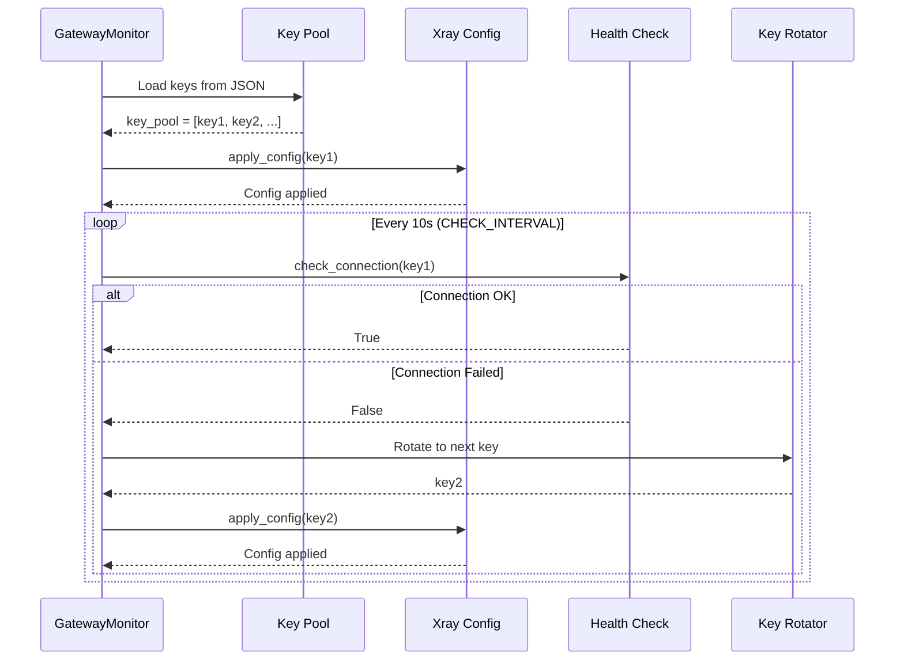

# Monitor Module - Gateway Monitoring and Key Rotation

## Overview

The `monitor/` module provides gateway monitoring and automatic key rotation functionality. It continuously monitors VLESS key connectivity and rotates to backup keys when connections fail, ensuring high availability of the proxy service.

## Module Structure

```
monitor/
├── __init__.py    # Module exports
├── gateway.py     # GatewayMonitor class (main monitoring logic)
└── rotator.py     # KeyRotator class (key rotation logic)
```

## Core Components

### 1. GatewayMonitor ([`gateway.py`](gateway.py))

Main monitoring class that handles:
- Loading VLESS keys from JSON files
- Checking connection health
- Automatic key rotation on failure
- Multi-client mode support

#### Constructor

```python
GatewayMonitor(keys_path: str, xray_manager: 'XrayManager')
```

| Parameter | Description |
|-----------|-------------|
| `keys_path` | Path to JSON file containing VLESS keys |
| `xray_manager` | XrayManager instance for config generation |

#### Key Properties

| Property | Type | Description |
|----------|------|-------------|
| `key_pool` | List[str] | List of loaded VLESS keys |
| `current_index` | int | Current key index in rotation |

#### Key Methods

| Method | Description |
|--------|-------------|
| `load_key_pool()` | Load keys from JSON file |
| `check_connection(key)` | Test VLESS key connectivity |
| `run()` | Main monitoring loop |

#### Key Loading Logic

Keys are extracted recursively from JSON structures with patterns:
- `{"top10": [{"key": "vless://..."}]}`
- `{"top5": [{"key": "vless://..."}]}`
- Nested dictionaries and lists

Example JSON structure:
```json
{
  "top10": [
    {"key": "vless://uuid1@host1:443?security=tls#tag1"},
    {"key": "vless://uuid2@host2:443?security=reality#tag2"}
  ],
  "top5": [
    {"key": "vless://uuid3@host3:443#tag3"}
  ]
}
```

#### Connection Check Logic

```python
async def check_connection(key: str) -> bool
```

1. Parse VLESS key to extract host:port
2. Try to establish TCP connection
3. Close connection after successful connection
4. Return `True` on success, `False` on failure
5. Timeout: 5 seconds (CONFIG_CHECK_TIMEOUT)

#### Monitoring Loop

```python
async def run() -> None
```

##### Single-Key Mode (GATEWAY_MODE=single)



##### Multi-Client Mode (GATEWAY_MODE=multi)

- All client keys are connected simultaneously
- No key rotation occurs
- Configuration is applied once and never changed

#### Environment Variables

| Variable | Default | Description |
|----------|---------|-------------|
| `GATEWAY_MODE` | single | Mode: single or multi |
| `CHECK_INTERVAL` | 10.0 | Health check interval (seconds) |
| `CHECK_TIMEOUT` | 5.0 | Connection check timeout (seconds) |
| `CLIENT_UUIDS` | [] | UUIDs for multi-client mode |
| `CLIENT_KEYS` | [] | VLESS keys for multi-client mode |

### 2. KeyRotator ([`rotator.py`](rotator.py))

Independent key rotation logic that can be used separately from GatewayMonitor.

#### Constructor

```python
KeyRotator(key_pool: List[str])
```

#### Key Properties

| Property | Type | Description |
|----------|------|-------------|
| `key_pool` | List[str] | List of keys to rotate through |
| `current_index` | int | Current key index |
| `pool_size` | int | Total number of keys |

#### Key Methods

| Method | Description | Returns |
|--------|-------------|---------|
| `get_current_key()` | Get current key without rotation | Optional[str] |
| `rotate()` | Rotate to next key | Optional[str] |
| `get_next_key()` | Get next key without rotating | Optional[str] |
| `get_index()` | Get current key index | int |
| `set_index(index)` | Set current key index | KeyRotator |
| `is_key_alive(key)` | Check if key is current | bool |
| `reset()` | Reset to first key | KeyRotator |

#### Example Usage

```python
from monitor.rotator import KeyRotator

# Initialize with key pool
rotator = KeyRotator(["key1", "key2", "key3"])

# Get current key
current = rotator.get_current_key()  # "key1"

# Rotate to next key
rotator.rotate()  # Now at key2
current = rotator.get_current_key()  # "key2"

# Get next without rotating
next_key = rotator.get_next_key()  # "key3" (still at key2)

# Get current index
idx = rotator.get_index()  # 1

# Check if key is current
is_current = rotator.is_key_alive("key2")  # True
```

## Module Exports ([`__init__.py`](__init__.py))

```python
from monitor import (
    GatewayMonitor,  # Main monitoring class
    KeyRotator,      # Key rotation logic
)
```

## Integration with Config Module

The `monitor/` module works with `config/` module through `XrayManager`:

```python
from config.builder import XrayConfigBuilder
from monitor.gateway import GatewayMonitor

# XrayManager uses config builder internally
xray_manager = XrayManager(config_path)

# Monitor uses XrayManager to apply configs
monitor = GatewayMonitor(keys_path, xray_manager)
```

## Complete Flow Diagram

```mermaid
graph TB
    subgraph "Initialization"
        A[Start Service] --> B[Load Environment]
        B --> C[XrayManager Created]
    end
    
    subgraph "Key Loading"
        C --> D[GatewayMonitor]
        D --> E[Load Keys from JSON]
        E --> F[key_pool = [...]]
    end
    
    subgraph "Configuration Loop"
        F --> G[Select Current Key]
        G --> H[XrayManager.apply_config]
        H --> I[Xray Config Generated]
        I --> J[Xray Service Restarted]
    end
    
    subgraph "Health Check Loop"
        J --> K[check_connection]
        K --> L{Connected?}
        L -->|Yes| M[Sleep 10s]
        L -->|No| N[Rotate Key]
        N --> O[Select Next Key]
        O --> G
        M --> G
    end
```

## Error Handling

| Error | Handling |
|-------|----------|
| Keys file not found | Log error, return False from load_key_pool() |
| Invalid key format | Return False from check_connection() |
| Connection timeout | Return False from check_connection() |
| Config apply failed | Log error, retry with backoff (1s) |
| Empty key pool | Log error, exit monitoring |

## State Management

### GatewayMonitor State

```
[key_pool]     -> List of available VLESS keys
[current_index] -> Current position in key_pool
[connected_key] -> Currently active key (internal)
```

### Key Rotation Algorithm

```python
# Round-robin rotation
current_index = (current_index + 1) % len(key_pool)
```

## Configuration Application

When a key rotation occurs, the following happens:

1. **Parse VLESS Key**
   - Extract UUID, address, port, security settings
   - Handle TLS/REALITY stream settings

2. **Generate Xray Config**
   ```python
   config = {
       "inbounds": [shadowsocks_inbound],
       "outbounds": [vless_outbound, direct_outbound, blocked_outbound],
       "routing": {rules...}
   }
   ```

3. **Write Config File**
   - Save to `/usr/local/etc/xray/config.json`

4. **Restart Xray Service**
   - `sudo systemctl restart xray`
   - Wait for service to start

5. **Update Internal State**
   - `self.current_key = new_key`

## Health Check Implementation

```python
async def check_connection(key: str) -> bool:
    vless_info = parse_vless_key(key)
    
    try:
        # Try to open TCP connection
        reader, writer = await asyncio.wait_for(
            asyncio.open_connection(vless_info["address"], vless_info["port"]),
            timeout=5.0
        )
        
        # Connection successful
        writer.close()
        await writer.wait_closed()
        return True
        
    except Exception as e:
        # Connection failed
        logger.debug(f"Connection check failed: {e}")
        return False
```

## Usage Examples

### Basic Monitoring

```python
import asyncio
from monitor.gateway import GatewayMonitor
from config.builder import XrayManager

async def main():
    xray_manager = XrayManager("/usr/local/etc/xray/config.json")
    monitor = GatewayMonitor("docs/keys.json", xray_manager)
    
    await monitor.run()  # Runs indefinitely

asyncio.run(main())
```

### Using KeyRotator Separately

```python
from monitor.rotator import KeyRotator

# Create rotator with your keys
rotator = KeyRotator([
    "vless://uuid1@host1:443#tag1",
    "vless://uuid2@host2:443#tag2",
    "vless://uuid3@host3:443#tag3"
])

# Get keys in rotation order
print(rotator.get_current_key())  # uuid1
rotator.rotate()
print(rotator.get_current_key())  # uuid2
```

### Manual Key Rotation

```python
# Before rotation
current = monitor.current_index

# Rotate
monitor.current_index = (monitor.current_index + 1) % len(monitor.key_pool)

# Apply new key
await monitor.xray_manager.apply_config(monitor.key_pool[monitor.current_index])
```

## Monitoring Loop Behavior

### Single-Key Mode

1. Load key pool from JSON
2. Apply first key configuration
3. Enter infinite loop:
   - Check connection health every 10 seconds
   - On failure, rotate to next key and reconfigure
   - On success, continue monitoring

### Multi-Client Mode

1. Load client settings from environment
2. Apply multi-client configuration
3. Enter infinite loop (no health checks, no rotation)

## Performance Considerations

| Aspect | Implementation |
|--------|----------------|
| Connection Check | Async TCP socket, non-blocking |
| Key Rotation | O(1) array index update |
| Config Building | Lazy, only on rotation |
| Health Check Interval | Configurable via CHECK_INTERVAL |
| Connection Timeout | Configurable via CHECK_TIMEOUT |

## Logging Output

```
2026-07-24 02:35:46,929 - INFO - === GATEWAY MANAGER STARTING ===
2026-07-24 02:35:46,930 - INFO - Loaded 10 keys from docs/keys.json
2026-07-24 02:35:46,930 - INFO - Initializing with first key: vless://uuid...
2026-07-24 02:35:47,000 - INFO - Config written to /usr/local/etc/xray/config.json
2026-07-24 02:35:48,000 - INFO - Restarted xray service
2026-07-24 02:35:49,000 - INFO - === STEP 4: START GATEWAY MONITOR ===
2026-07-24 02:35:49,000 - INFO - Gateway monitor started.
2026-07-24 02:35:59,000 - INFO - 🟢 Connection healthy. Node: example.com
2026-07-24 02:36:09,000 - WARNING - ⚠️ Connection lost! Current key is dead: vless://...
2026-07-24 02:36:09,000 - INFO - 🔄 Rotating to next key: vless://...
2026-07-24 02:36:10,000 - INFO - ✅ Rotation successful.
```

## Graceful Shutdown

The monitor loop can be interrupted with:
- `KeyboardInterrupt` (Ctrl+C)
- `SIGTERM` signal

Shutdown sequence:
1. Catch signal
2. Log shutdown message
3. Exit monitoring loop
4. Log shutdown complete

## Environment Variable Reference

| Variable | Required | Default | Description |
|----------|----------|---------|-------------|
| `KEYS_JSON_PATH` | No | docs/keys.json | Path to keys JSON file |
| `XRAY_CONFIG_PATH` | No | /usr/local/etc/xray/config.json | Xray config path |
| `GATEWAY_MODE` | No | single | Mode: single or multi |
| `CHECK_INTERVAL` | No | 10.0 | Health check interval (s) |
| `CHECK_TIMEOUT` | No | 5.0 | Connection check timeout (s) |
| `CLIENT_UUIDS` | Yes (multi) | [] | UUIDs for multi-client mode |
| `CLIENT_KEYS` | Yes (multi) | [] | VLESS keys for multi-client mode |
